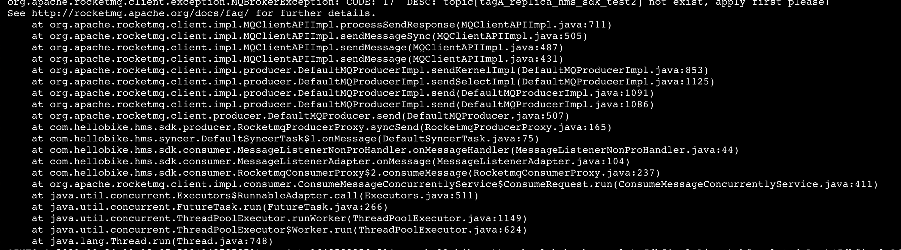

```
layout: post
title: "rocketmq自动创建失败"
subtitle: "如何快速排查网络问题"
date: 2021-11-24
author: liying
category: rocketmq
tags: [linux,rocketmq]
finished: true
```

[TOC]

## 问题：RocketMQ自动创建失效

​	在测试环境开放了自动创建的权限，但是在某个时间点后突然失效。无法创建，向未主动创建的主题发送消息，会报如下错误：



​	观察broker配置autoCreateTopicEnable=true，以及brokerPermission=6。说明开启了自动创建的开关，broker也是可以正常读写的。

​	主题的自动创建依赖了**TBW102**这个主题，发现这个主题的权限从**7变成了6**。


#### RocketMQ PERM含义

PERM_INHERIT：Topic继承，value：1
PermName.PERM_READ：Topic读，value：4
PermName.PERM_WRITE：Topic写，value：2

RocketMQ的Topic自动新建是通过继承TBW102实现的，如果把TBW102的perm改为6，将不会自动创建Topic


#### 变更topic PERM

- Topic的权限变更流程和Topic的创建流程是一致的。
- Topic的权限变更主要是变更broker的topic的配置信息并同步更新namesrv的Topic的Queue信息。

```shell
usage: mqadmin updateTopicPerm [-b <arg>] [-c <arg>] [-h] [-n <arg>] -p <arg> -t <arg>
 -b,--brokerAddr <arg>    create topic to which broker
 -c,--clusterName <arg>   create topic to which cluster
 -h,--help                Print help
 -n,--namesrvAddr <arg>   Name server address list, eg: 192.168.0.1:9876;192.168.0.2:9876
 -p,--perm <arg>          set topic's permission(2|4|6), intro[2:W; 4:R; 6:RW]
 -t,--topic <arg>         topic name
```

--topic指定待变更的topic信息

--brokerAddr指定变更某个broker的上topic的权限信息。

--clusterName指定变更某个rocketmq集群的topic的权限信息。

--perm 指定变更的权限信息。


**但是TBW102无法通过该方法变更成为7的权限，因updateTopicPerm为仅支持变更为2，4，6**


#### 解决

删除TBW102并重启broker，启动时会自动创建TBW102主题，并设置权限为7。

```java
if (this.brokerController.getBrokerConfig().isAutoCreateTopicEnable()) {
    String topic = TopicValidator.AUTO_CREATE_TOPIC_KEY_TOPIC;
    TopicConfig topicConfig = new TopicConfig(topic);
    TopicValidator.addSystemTopic(topic);
    topicConfig.setReadQueueNums(this.brokerController.getBrokerConfig()
        .getDefaultTopicQueueNums());
    topicConfig.setWriteQueueNums(this.brokerController.getBrokerConfig()
        .getDefaultTopicQueueNums());
    int perm = PermName.PERM_INHERIT | PermName.PERM_READ | PermName.PERM_WRITE;
    topicConfig.setPerm(perm);
    this.topicConfigTable.put(topicConfig.getTopicName(), topicConfig);
}
```


#### 原因

暂时未定位到准确原因，可能原因如下：

1. 删除TBW102主题后，又重新手动创建，默认为PERM 6。
2. 直接使用修改权限的命令修改TBW102主题。


参考：

1. https://www.jianshu.com/p/228e73593f83

2. https://my.oschina.net/QAAQ/blog/3131002

3. https://blog.csdn.net/weixin_43975408/article/details/116052715

4. https://blog.csdn.net/aa1215018028/article/details/83302438